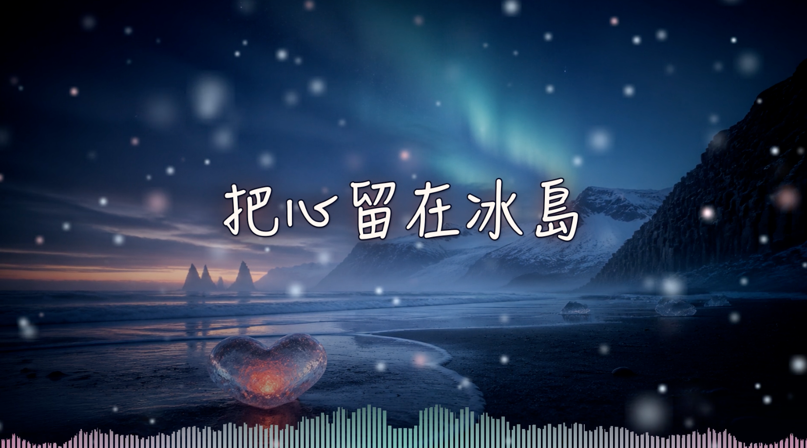
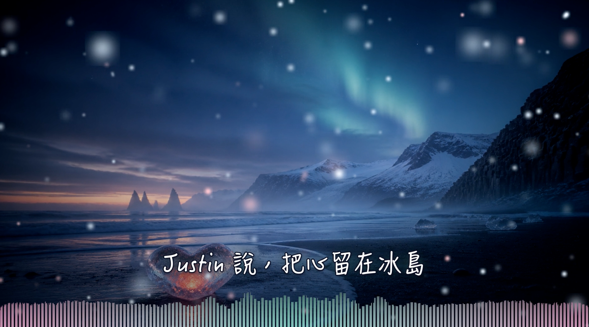

<a id="top"></a>

<div align="center">

# 🎵 Lyric Video Generator

**Turn a song + a lyrics text file + one background image into a polished, animated lyric video.**

[](https://www.python.org/)
[](https://ffmpeg.org/)
[](https://github.com/SYSTRAN/faster-whisper)
[](#-requirements)
[](LICENSE)
[](#-contributing)

🌐 **[English](#english)** · **[繁體中文](#zh-tw)**





</div>

---

<a id="english"></a>

## 🇬🇧 English

> 🔗 Jump to: [Features](#-features) · [How it works](#-how-it-works) · [Requirements](#-requirements) · [Installation](#-installation) · [Usage](#-usage) · [Options](#-options) · [Fonts](#-fonts) · [FAQ](#-faq) · [中文說明](#zh-tw)

### ✨ Features

| | |
|---|---|
| 🎤 **Automatic lyric timing** | Whisper transcribes the vocals, then a character-level alignment (Needleman–Wunsch) maps *your* lyrics onto the recognized timeline. You get an `.srt` with the original text, not the model's guesses. |
| 🈶 **Traditional / Simplified aware** | Both sides are normalized with OpenCC before matching, so `長` vs `长` never breaks a line's timing. |
| 🖼️ **Ken Burns background** | Slow push-in and drift on your still image, plus vignette and a bottom gradient for legibility. |
| ✍️ **Handwritten Chinese fonts** | Ships with presets for macOS built-in fonts (翩翩體 HanziPen, 手札體 Hannotate, 行楷 Xingkai, 蘋方 PingFang) and accepts any `.ttf` / `.otf` / `.ttc` you provide. |
| 🌌 **Glow + outline text** | Each line is rendered with a soft aurora glow and an optional dark outline for that classic white-on-black lyric look. |
| 📊 **Music spectrum** | A mirrored equalizer (bass in the center) driven by the actual audio, tinted from aurora-teal to pink. |
| ❄️ **Particles** | Drifting, swaying, twinkling snow and bokeh particles generated frame-by-frame with NumPy and piped straight into FFmpeg. |
| 🎬 **One command** | `audio_to_srt.py --image bg.png` goes from MP3 to finished MP4 in one go. |

### 🧠 How it works

```
song.mp3 ──► faster-whisper (word timestamps)
                     │
lyrics.txt ──► char-level DP alignment ──► song.srt
                                             │
bg.png ──► Ken Burns + vignette              │
NumPy  ──► particle layer (RGBA, stdin pipe) │
FFmpeg ──► showfreqs spectrum ───────────────┼──► overlay stack ──► song.mp4
PIL    ──► glow / outline text PNG per line ─┘
```

* **Alignment** treats *substitutions* (a misheard character in the right position) as valid time evidence, so a line whose first word Whisper misheard still starts at the right moment.
* **Text** is pre-rendered to transparent PNGs with Pillow because Homebrew's FFmpeg is usually built **without libass**. Fade / slide / timing are then done with FFmpeg's `fade` + `overlay`.
* **Particles** are computed at half resolution (960×540) and streamed to FFmpeg via `stdin` as raw RGBA, so nothing is written to disk.

### 📦 Requirements

* macOS (font presets point at macOS system fonts; on Linux/Windows just pass `--font path/to/font.ttf`)
* Python 3.10+
* [FFmpeg](https://ffmpeg.org/) on your `PATH` (`brew install ffmpeg`)
* Python packages: `faster-whisper`, `opencc-python-reimplemented`, `pillow`, `numpy`

### 🚀 Installation

```bash
git clone https://github.com/PeterPanSwift/lyric-video-generator.git
cd lyric-video-generator
pip install -r requirements.txt
brew install ffmpeg        # if you don't have it yet
```

### 🎯 Usage

**1️⃣ One-shot: audio + lyrics + image → video**

```bash
python3 audio_to_srt.py song.mp3 lyrics.txt --image bg.png
```

Produces `song.srt` and `song.mp4` next to the audio file.

**2️⃣ Step by step**

```bash
# Generate a timed SRT from your lyrics (one line per subtitle, blank lines ignored)
python3 audio_to_srt.py song.mp3 lyrics.txt

# Render the video from an existing SRT
python3 make_lyric_video.py song.mp3 song.srt bg.png -o song.mp4
```

**3️⃣ Transcription only (no lyrics file)**

```bash
python3 audio_to_srt.py podcast.mp3 --model medium --language zh --vad
```

### ⚙️ Options

<details>
<summary><b>audio_to_srt.py</b></summary>

| Flag | Default | Description |
|---|---|---|
| `lyrics` | – | Lyrics text file; when given, subtitles use your text and are aligned to the audio |
| `--model` | `small` | Whisper size: `tiny` `base` `small` `medium` `large-v3` |
| `--language` | auto | e.g. `zh`, `en`, `ja` |
| `-o, --output` | `<audio>.srt` | SRT path |
| `--vad` | off | Voice-activity filter — good for speech, **leave off for songs** |
| `--image` | – | Background image; triggers video rendering after the SRT |
| `--title` | audio filename | Title card text (`""` to hide) |
| `--font` | `hanzipen` | Preset name or a font file |
| `--font-index` | `0` | Face index inside a `.ttc` |
| `--title-font` | same as lyrics | Separate font for the title card |
| `--stroke` | `0` | Outline width in px (`3` = white-on-black handwriting look) |
| `--no-spectrum` / `--no-particles` | – | Disable an effect |

</details>

<details>
<summary><b>make_lyric_video.py</b></summary>

| Flag | Default | Description |
|---|---|---|
| `-o, --output` | `<audio>.mp4` | Output path |
| `--title` | audio filename | Title card text (`""` to hide) |
| `--fps` | `30` | Frame rate |
| `--lyric-size` / `--title-size` | `66` / `120` | Font sizes in px (handwriting presets are auto-scaled) |
| `--crf` | `18` | x264 quality, lower = better |
| `--font` | `hanzipen` | `hanzipen` 翩翩體 · `pingfang` 蘋方 · `hannotate` 手札體 · `xingkai` 行楷 · or `path/to/font.ttf` |
| `--font-index` | `0` | Face index inside a `.ttc` |
| `--title-font` / `--title-font-index` | – | Separate font for the title card |
| `--stroke` | `0` | Outline width in px |
| `--no-spectrum` | – | Hide the audio spectrum |
| `--no-particles` | – | Hide the particles |
| `--particles` | `160` | Particle count |
| `--spectrum-height` | `150` | Spectrum height in px |

</details>

### 🔤 Fonts

* **Presets** use fonts that ship with macOS. Apple's macOS license lets you use them to display and print content (rendering a video counts), so publishing your lyric videos is fine. Don't copy the font files to other machines.
* **Bring your own** open-licensed font for a zero-worry, cross-platform setup:

```bash
python3 make_lyric_video.py song.mp3 song.srt bg.png --font ~/Fonts/ChenYuluoyan-2.0-Thin.ttf --stroke 3
```

Recommended free handwritten fonts with Traditional Chinese coverage (SIL OFL): [辰宇落雁體](https://github.com/Chenyu-otf/chenyuluoyan_thin), [霞鶩文楷 TC](https://github.com/lxgw/LxgwWenKai-TC), [清松手寫體](https://jasonhandwriting.github.io/).

### ❓ FAQ

**A line starts late / ends early.**
Whisper probably misheard the first or last characters. Substitutions are already counted as evidence; if it still drifts, try `--model medium` or `--language zh`.

**The text overlaps my image's focal point.**
Lyrics sit at 80 % of the frame height. Change `lyric_y` in `make_lyric_video.py` or pick an image whose subject isn't at the bottom center.

**Can I run it on Linux / Windows?**
Yes — install FFmpeg, pass `--font path/to/font.ttf`, and everything else is portable.

### 🤝 Contributing

Issues and pull requests are welcome. Ideas: karaoke-style per-character highlight, more particle presets, GPU encoding.

### 📄 License

[MIT](LICENSE) — the demo image and song are for illustration only and are not part of the license.

<div align="right"><a href="#top">⬆️ back to top</a></div>

---

<a id="zh-tw"></a>

## 🇹🇼 繁體中文

> 🔗 快速跳轉：[功能](#-功能) · [運作原理](#-運作原理) · [環境需求](#-環境需求) · [安裝](#-安裝) · [使用方式](#-使用方式) · [參數](#-參數) · [字型](#-字型) · [常見問題](#-常見問題) · [English](#english)

### ✨ 功能

| | |
|---|---|
| 🎤 **自動對齊歌詞時間** | 用 Whisper 辨識人聲，再以字元層級的動態規劃對齊（Needleman–Wunsch）把**你的歌詞原文**貼到辨識時間軸上，輸出的 `.srt` 是你的字，不是模型猜的字。 |
| 🈶 **簡繁自動統一** | 比對前用 OpenCC 把雙方統一成簡體，`長` 對 `长` 不會再被當成聽錯而丟掉時間。 |
| 🖼️ **Ken Burns 背景** | 靜態圖片慢速推鏡加輕微漂移，搭配暗角與下方漸層壓暗，歌詞更好讀。 |
| ✍️ **手寫中文字型** | 內建 macOS 字型預設組（翩翩體、手札體、行楷、蘋方），也能直接指定任何 `.ttf` / `.otf` / `.ttc`。 |
| 🌌 **光暈 + 描邊** | 每句歌詞帶柔和極光光暈，可加深色描邊做出經典的白字黑邊手寫風。 |
| 📊 **音樂頻譜** | 由真實音訊驅動的鏡像等化器，低音在正中間，顏色從極光青漸變到粉紫。 |
| ❄️ **粒子** | 飄升、搖曳、閃爍的雪花與光點，用 NumPy 逐幀計算並直接串流進 FFmpeg。 |
| 🎬 **一個指令完成** | `audio_to_srt.py --image bg.png` 從 MP3 一路做到 MP4。 |

### 🧠 運作原理

```
song.mp3 ──► faster-whisper（逐字時間戳）
                     │
lyrics.txt ──► 字元層級 DP 對齊 ──► song.srt
                                      │
bg.png ──► Ken Burns + 暗角           │
NumPy  ──► 粒子層（RGBA，stdin 管線） │
FFmpeg ──► showfreqs 頻譜 ────────────┼──► 逐層 overlay ──► song.mp4
PIL    ──► 每句歌詞的光暈/描邊 PNG ───┘
```

* **對齊**時把「替換」（位置對上但字被聽錯）也視為有效的時間證據，所以句首被聽錯的句子仍會在正確的時間出現。
* **文字**先用 Pillow 畫成透明 PNG，因為 Homebrew 的 FFmpeg 通常**沒有編入 libass**；淡入、上滑、時間控制交給 FFmpeg 的 `fade` 與 `overlay`。
* **粒子**在半解析度（960×540）計算，以原始 RGBA 經 `stdin` 串流給 FFmpeg，不寫任何暫存檔。

### 📦 環境需求

* macOS（字型預設組指向 macOS 系統字型；Linux / Windows 請用 `--font 字型檔路徑`）
* Python 3.10+
* [FFmpeg](https://ffmpeg.org/)（`brew install ffmpeg`）
* Python 套件：`faster-whisper`、`opencc-python-reimplemented`、`pillow`、`numpy`

### 🚀 安裝

```bash
git clone https://github.com/PeterPanSwift/lyric-video-generator.git
cd lyric-video-generator
pip install -r requirements.txt
brew install ffmpeg        # 還沒裝的話
```

### 🎯 使用方式

**1️⃣ 一條龍：音檔 + 歌詞 + 圖片 → 影片**

```bash
python3 audio_to_srt.py song.mp3 lyrics.txt --image bg.png
```

會在音檔旁邊產生 `song.srt` 與 `song.mp4`。

**2️⃣ 分步驟**

```bash
# 從歌詞產生帶時間的 SRT（一行一句，空行會忽略）
python3 audio_to_srt.py song.mp3 lyrics.txt

# 用現成的 SRT 合成影片
python3 make_lyric_video.py song.mp3 song.srt bg.png -o song.mp4
```

**3️⃣ 純辨識（沒有歌詞檔）**

```bash
python3 audio_to_srt.py podcast.mp3 --model medium --language zh --vad
```

### ⚙️ 參數

<details>
<summary><b>audio_to_srt.py</b></summary>

| 參數 | 預設 | 說明 |
|---|---|---|
| `lyrics` | – | 歌詞 txt；提供時字幕用你的原文並自動對齊 |
| `--model` | `small` | Whisper 模型：`tiny` `base` `small` `medium` `large-v3` |
| `--language` | 自動 | 例如 `zh`、`en`、`ja` |
| `-o, --output` | `<音檔>.srt` | SRT 輸出路徑 |
| `--vad` | 關 | 人聲活動過濾，適合純語音，**歌曲請勿開啟** |
| `--image` | – | 背景圖；提供時產生 SRT 後接著合成影片 |
| `--title` | 音檔檔名 | 片頭歌名（`""` 不顯示） |
| `--font` | `hanzipen` | 預設名稱或字型檔 |
| `--font-index` | `0` | `.ttc` 內的字面編號 |
| `--title-font` | 同歌詞 | 片頭歌名另指定字型 |
| `--stroke` | `0` | 描邊粗細 px（`3` = 白字黑邊手寫風） |
| `--no-spectrum` / `--no-particles` | – | 關閉特效 |

</details>

<details>
<summary><b>make_lyric_video.py</b></summary>

| 參數 | 預設 | 說明 |
|---|---|---|
| `-o, --output` | `<音檔>.mp4` | 輸出路徑 |
| `--title` | 音檔檔名 | 片頭歌名（`""` 不顯示） |
| `--fps` | `30` | 影格率 |
| `--lyric-size` / `--title-size` | `66` / `120` | 字級 px（手寫預設組會自動放大） |
| `--crf` | `18` | x264 畫質，越小越好 |
| `--font` | `hanzipen` | `hanzipen` 翩翩體 · `pingfang` 蘋方 · `hannotate` 手札體 · `xingkai` 行楷 · 或 `字型檔路徑` |
| `--font-index` | `0` | `.ttc` 內的字面編號 |
| `--title-font` / `--title-font-index` | – | 片頭歌名另指定字型 |
| `--stroke` | `0` | 描邊粗細 px |
| `--no-spectrum` | – | 不顯示頻譜 |
| `--no-particles` | – | 不顯示粒子 |
| `--particles` | `160` | 粒子數量 |
| `--spectrum-height` | `150` | 頻譜高度 px |

</details>

### 🔤 字型

* **預設組**使用 macOS 內建字型。Apple 的 macOS 授權允許用它們顯示與列印內容（渲染影片屬於此類），所以公開發布歌詞影片沒問題；但字型檔不可複製到其他機器使用。
* **自備字型**：想要零疑慮、跨平台，請用開源授權字型：

```bash
python3 make_lyric_video.py song.mp3 song.srt bg.png --font ~/Fonts/ChenYuluoyan-2.0-Thin.ttf --stroke 3
```

推薦的免費繁體手寫字型（SIL OFL 授權）：[辰宇落雁體](https://github.com/Chenyu-otf/chenyuluoyan_thin)、[霞鶩文楷 TC](https://github.com/lxgw/LxgwWenKai-TC)、[清松手寫體](https://jasonhandwriting.github.io/)。

### ❓ 常見問題

**某句歌詞出現太晚或消失太早。**
多半是 Whisper 聽錯了句首或句尾的字。替換已被計入時間證據；若仍有偏差，試試 `--model medium` 或 `--language zh`。

**歌詞蓋到圖片的主體。**
歌詞位置在畫面高度 80 %。可修改 `make_lyric_video.py` 裡的 `lyric_y`，或換一張主體不在下方正中的圖。

**可以在 Linux / Windows 上跑嗎？**
可以。裝好 FFmpeg，用 `--font 字型檔路徑`，其餘都是跨平台的。

### 🤝 貢獻

歡迎 issue 與 pull request。可以做的方向：卡拉 OK 式逐字變色、更多粒子風格、GPU 編碼。

### 📄 授權

[MIT](LICENSE)。示範用的圖片與歌曲僅供展示，不在授權範圍內。

<div align="right"><a href="#top">⬆️ 回到頂端</a></div>
